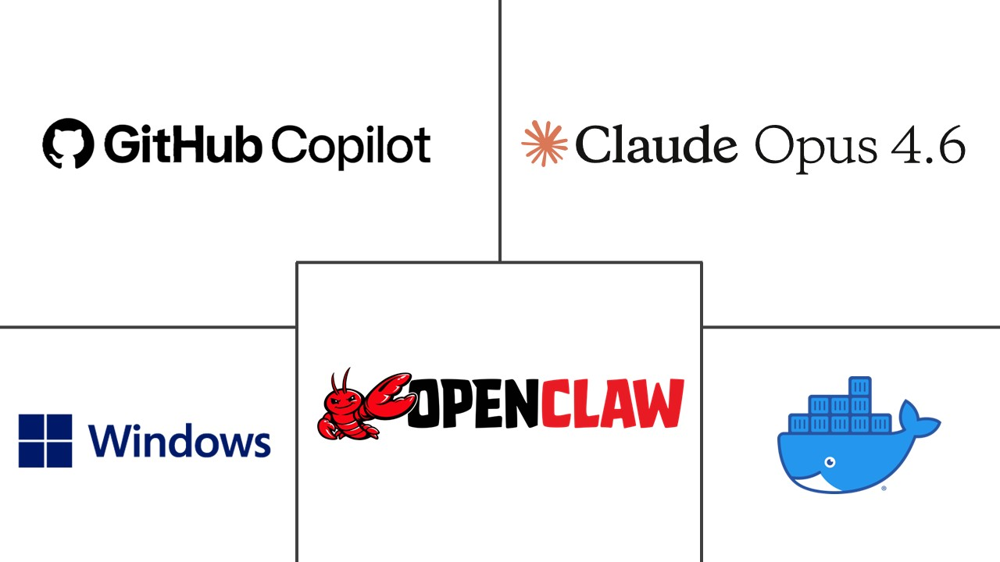
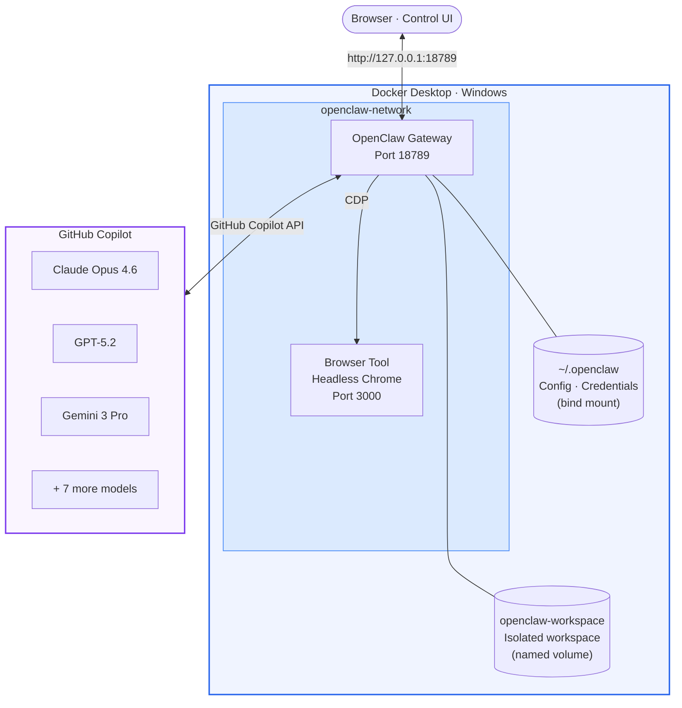

# OpenClaw: Secure Docker Setup on Windows

<p align="center">
  
</p>

Run [OpenClaw](https://github.com/openclaw/openclaw) on Docker with workspace volume isolation and GitHub Copilot as the LLM provider.

## What is OpenClaw

[OpenClaw](https://openclaw.ai/) is an open-source, self-hosted personal AI assistant. You run a single Gateway process on your own machine or a server, and it connects your chat apps (WhatsApp, Telegram, Discord, Slack, Signal, iMessage) to AI agents. Built for developers and power users who want a personal assistant they can message from anywhere without giving up control of their data.

[](https://github.com/openclaw/openclaw) · [Docs](https://docs.openclaw.ai/) · [Source](https://github.com/openclaw/openclaw) · [DeepWiki](https://deepwiki.com/openclaw/openclaw)

## What this repo does

This repo contains a Docker Compose configuration, a PowerShell setup script, and a full walkthrough for running OpenClaw on Windows with Docker Desktop.

The main difference from the [upstream Docker guide](https://docs.openclaw.ai/install/docker): the agent workspace runs in an isolated Docker volume instead of a bind mount to your host filesystem. Config and credentials stay accessible from Windows via bind mount, but workspace files (persona, memory, generated content) remain inside Docker storage. The setup also includes a Browserless Chrome container for the [browser tool](https://docs.openclaw.ai/tools/browser), so the agent can browse the web without touching your personal browser.

GitHub Copilot authenticates via device flow with your existing GitHub account. No API keys to manage.

## Architecture



The setup script creates the Docker volume, builds the OpenClaw image from source, runs non-interactive onboard, sets the model to `claude-opus-4.6`, starts the containers, and configures browser automation. GitHub Copilot authentication is the only manual step (requires a browser).

<details>
<summary>Available models via GitHub Copilot</summary>

| Provider | Model |
|----------|-------|
| Anthropic | `claude-opus-4.6`, `claude-sonnet-4.5`, `claude-haiku-4.5` |
| OpenAI | `gpt-5.2`, `gpt-5.2-codex`, `gpt-5.1-codex-max`, `gpt-5-mini` |
| Google | `gemini-3-pro`, `gemini-3-flash` |
| xAI | `grok-code-fast-1` |

Switch models after deployment:

```powershell
docker compose run --rm openclaw-cli models set <model-id>
```

</details>

## Prerequisites

- **Docker Desktop** with Docker Compose v2
- **GitHub Copilot** subscription
- **Git**
- **Windows 10/11** with WSL2

## Quick Start

```powershell
# Clone and run the setup script
git clone https://github.com/spiroskon/openclaw-secure-docker.git
cd openclaw-secure-docker
.\setup-openclaw.ps1

# Authenticate GitHub Copilot (only interactive step)
cd openclaw-repo
docker compose run --rm openclaw-cli models auth login-github-copilot

# Open Control UI (token shown in script output)
# http://127.0.0.1:18789/?token=<your-token>
```

### Verify

```powershell
docker compose ps
docker compose exec openclaw-gateway node openclaw.mjs model status
docker compose exec openclaw-gateway node openclaw.mjs security audit
```

Both containers should show `Up`, the model should be `github-copilot/claude-opus-4.6`, and the security audit should return a summary.

---

<details>
<summary>Step-by-step installation (without the setup script)</summary>

If you prefer to run each step individually, or the script doesn't work in your environment:

### Step 1: Clone repos

```powershell
git clone https://github.com/spiroskon/openclaw-secure-docker.git
cd openclaw-secure-docker
git clone https://github.com/openclaw/openclaw openclaw-repo
cd openclaw-repo
Copy-Item -Path "..\docker-compose.yml" -Destination "docker-compose.yml"
```

This repo has the `docker-compose.yml` with workspace isolation. The OpenClaw repo has the Dockerfile and source code. `Copy-Item` puts the compose file where `docker build` and `docker compose` run.

### Step 2: Create config directory and workspace volume

```powershell
$openclaw_home = "$env:USERPROFILE\.openclaw"
New-Item -ItemType Directory -Path $openclaw_home -Force

docker volume create openclaw-workspace
docker run --rm -v openclaw-workspace:/workspace alpine chown -R 1000:1000 /workspace
```

The config directory is bind-mounted so you can edit `openclaw.json` from Windows. The workspace volume is isolated in Docker storage. The `chown` fixes permissions for the `node` user (UID 1000) that OpenClaw runs as inside the container.

### Step 3: Build the Docker image

```powershell
docker build -t openclaw:local -f Dockerfile .
```

Takes approximately 5-10 minutes depending on your connection.

### Step 4: Configure the gateway

```powershell
docker compose run --rm openclaw-cli onboard `
  --non-interactive `
  --accept-risk `
  --mode local `
  --flow manual `
  --auth-choice skip `
  --gateway-port 18789 `
  --gateway-bind lan `
  --gateway-auth token `
  --skip-channels `
  --skip-skills `
  --skip-daemon `
  --skip-health
```

This runs non-interactive onboard with token auth and auto-generates a gateway token (saved to `~/.openclaw/openclaw.json`).

A gateway connection error at the end is expected. The gateway isn't running yet (that's Step 7).

<details>
<summary>Alternative: interactive wizard</summary>

```powershell
docker compose run --rm openclaw-cli onboard
```

| Prompt | Choose | Notes |
|--------|--------|-------|
| Security warning | **Yes** | |
| Onboarding mode | **Manual** | Full control |
| Gateway location | **Local (this machine)** | Inside container |
| Model/auth provider | **Skip** | Copilot auth is separate (Step 6) |
| Gateway port | **Enter** (18789) | Default |
| Gateway bind | **LAN (0.0.0.0)** | Required for Docker networking |
| Gateway auth | **Token** | Auto-generated |
| Tailscale | **Off** | |
| Channels | **Skip** | |
| Skills | **Yes** then **Skip** dependencies | |
| Hooks | **Skip** | |
| How to hatch | **Do this later** | |
| Zsh completion | **No** | |

</details>

### Step 5: Set the model

```powershell
docker compose run --rm openclaw-cli models set github-copilot/claude-opus-4.6
```

Model IDs use dots, not hyphens: `claude-opus-4.6` works, `claude-opus-4-6` gives "Unknown model".

### Step 6: Authenticate GitHub Copilot

```powershell
docker compose run --rm openclaw-cli models auth login-github-copilot
```

The terminal shows a URL and a one-time code. Open `https://github.com/login/device` in your browser, enter the code, and authorize. Keep the terminal open until authorization completes.

### Step 7: Start the gateway

```powershell
docker compose up -d
docker compose ps
```

You should see two containers running: `openclaw-gateway` and `openclaw-browser`.

### Step 8: Enable token-only auth for Control UI

```powershell
docker compose exec openclaw-gateway node openclaw.mjs config set gateway.controlUi.allowInsecureAuth true
docker compose restart openclaw-gateway
```

When accessing `http://127.0.0.1:18789/` from Windows, the gateway sees the connection from the Docker bridge network, not localhost. This setting lets the Control UI connect with just a token. You can harden this later with [device pairing](#optional-device-pairing).

### Step 9: Access the Control UI

```powershell
docker compose exec openclaw-gateway node openclaw.mjs config get gateway.auth.token
```

Open `http://127.0.0.1:18789/?token=<TOKEN>` in your browser.

### Step 10: Configure browser automation

```powershell
docker compose exec openclaw-gateway node openclaw.mjs config set browser.enabled true
docker compose exec openclaw-gateway node openclaw.mjs config set browser.defaultProfile docker
docker compose exec openclaw-gateway node openclaw.mjs config set browser.profiles.docker '{"cdpUrl": "http://openclaw-browser:3000", "color": "#00AA00"}'
docker compose restart openclaw-gateway
```

Open http://localhost:3000 to see the Browserless debugger UI with active sessions.

</details>

---

## Security Audit

OpenClaw includes a built-in security scanner. Run it after setup:

```powershell
docker compose exec openclaw-gateway node openclaw.mjs security audit
```

Expected findings (`2 critical · 1 warn · 1 info`):

| Finding | Severity | Explanation |
|---------|----------|-------------|
| `allowInsecureAuth` enabled | CRITICAL | Needed for initial setup. Removable via [device pairing](#optional-device-pairing) |
| State dir world-writable (777) | CRITICAL | Docker named volume shows as 777 from the host. Actual files are owned by `node` (UID 1000) with correct permissions |
| No auth rate limiting | WARN | 256-bit token makes brute force infeasible |

All findings are expected for a Docker setup. Completing device pairing removes the `allowInsecureAuth` finding.

## Optional: Device Pairing

After verifying everything works, you can disable `allowInsecureAuth` and use cryptographic device identity instead. This removes the critical audit finding.

CLI commands that talk to the gateway need `--url ws://127.0.0.1:18789 --token <TOKEN>` to connect via loopback inside the container. Without these flags, the CLI connects via the Docker bridge IP and gets rejected.

```powershell
# Get gateway token
$TOKEN = docker compose exec openclaw-gateway node openclaw.mjs config get gateway.auth.token

# Disable insecure auth
docker compose exec openclaw-gateway node openclaw.mjs config set gateway.controlUi.allowInsecureAuth false
docker compose restart openclaw-gateway

# Open or refresh browser. You'll see "pairing required"
# This creates a pending device request

# Approve the browser device
docker compose exec openclaw-gateway node openclaw.mjs devices approve --latest --url ws://127.0.0.1:18789 --token $TOKEN

# Refresh browser — device is now paired
```

To re-enable token-only auth if needed:

```powershell
docker compose exec openclaw-gateway node openclaw.mjs config set gateway.controlUi.allowInsecureAuth true
docker compose restart openclaw-gateway
```

Clearing browser data or switching browsers requires re-pairing.

## How Workspace Isolation Works

This setup uses two Docker mounts. This is the main difference from the upstream Docker guide:

| Mount | Type | Purpose |
|-------|------|---------|
| `~/.openclaw:/home/node/.openclaw` | Bind mount | Config, credentials, sessions. Editable from Windows |
| `openclaw-workspace:/home/node/.openclaw/workspace` | Named volume | Agent workspace files. Isolated in Docker storage |

The named volume shadows the workspace path inside the bind mount. Agent writes (persona files, daily memory, generated content) stay inside Docker. Your Windows filesystem is not exposed to the agent.

To read workspace files:

```powershell
docker compose exec openclaw-gateway cat /home/node/.openclaw/workspace/SOUL.md
```

To back up:

```powershell
docker run --rm -v openclaw-workspace:/data -v ~/backup:/backup alpine cp -a /data /backup
```

See the [official workspace docs](https://docs.openclaw.ai/concepts/agent-workspace) for the full file layout.

## Useful Commands

| Command | Description |
|---------|-------------|
| `docker compose up -d` | Start all services |
| `docker compose down` | Stop all services |
| `docker compose restart openclaw-gateway` | Restart gateway |
| `docker compose logs -f openclaw-gateway` | Follow gateway logs |
| `docker compose run --rm openclaw-cli <command>` | Run CLI commands |
| `docker compose exec openclaw-gateway node openclaw.mjs security audit` | Security audit |

## Next Steps

**Web search:** Get a free Brave Search API key at https://brave.com/search/api/ and configure it:

```powershell
docker compose exec openclaw-gateway node openclaw.mjs config set tools.web.search.apiKey "YOUR_BRAVE_KEY"
docker compose restart openclaw-gateway
```

**Chat channels:** Create a Telegram bot via [@BotFather](https://t.me/BotFather) and add it:

```powershell
docker compose exec openclaw-gateway node openclaw.mjs channels add --channel telegram --token "YOUR_BOT_TOKEN"
```

## Known Issues

### "Conversation info (untrusted metadata)" in chat

OpenClaw 2026.2.17+ displays a metadata block in the Control UI for every message:

```
Conversation info (untrusted metadata):
{"message_id": "...", "sender": "openclaw-control-ui"}
```

This is an upstream UI bug, not a security issue with this setup. The gateway injects `message_id` metadata for LLM context, but the Control UI renders it verbatim instead of stripping it. "Untrusted" refers to the gateway's security model (client-supplied metadata is never trusted), not to this deployment.

Upstream issues: [#13989](https://github.com/openclaw/openclaw/issues/13989), [#20297](https://github.com/openclaw/openclaw/issues/20297). Fix PRs: [#14045](https://github.com/openclaw/openclaw/pull/14045), [#15998](https://github.com/openclaw/openclaw/pull/15998).

**Workaround:** Pin to `v2026.2.15` (`git checkout v2026.2.15` before building).

## Tested With

| Component | Version |
|-----------|---------|
| OpenClaw | Latest from `main` branch (Feb 2026) |
| Docker Desktop | 4.x with Docker Compose v2 |
| Windows | 10/11 with WSL2 |
| LLM | `github-copilot/claude-opus-4.6` |

## References

- [OpenClaw Docs](https://docs.openclaw.ai)
- [OpenClaw Docker Install](https://docs.openclaw.ai/install/docker)
- [OpenClaw Security](https://docs.openclaw.ai/gateway/security)
- [GitHub Copilot](https://github.com/features/copilot)
- [OpenClaw on Azure Container Apps](https://github.com/spiroskon/openclaw-azure-containerapps)

## License

MIT
