# OpenClaw Architecture Diagrams

Mermaid diagrams visualizing the Docker deployment architecture.

---

## Container Architecture

```mermaid
graph TB
    subgraph Windows["Windows Host"]
        Browser["🌐 Browser<br/>localhost:18789"]
        ConfigDir["📁 ~/.openclaw<br/>(bind mount)"]
        BrowserDebug["🔍 Browserless UI<br/>localhost:3000"]
    end

    subgraph Docker["Docker (WSL2)"]
        subgraph Network["openclaw-network (bridge)"]
            Gateway["🔧 openclaw-gateway<br/>OpenClaw:local<br/>Port 18789"]
            ChromeContainer["🌍 openclaw-browser<br/>browserless/chrome<br/>Port 3000"]
        end
        
        WorkspaceVol[("📦 openclaw-workspace<br/>(Docker volume)")]
    end

    subgraph External["External Services"]
        GitHubCopilot["🤖 GitHub Copilot API<br/>Claude, GPT-4, etc."]
        Websites["🌐 Web (via browser)"]
    end

    Browser -->|"HTTP + token"| Gateway
    BrowserDebug -->|"View sessions"| ChromeContainer
    Gateway -->|"CDP Protocol"| ChromeContainer
    ChromeContainer -->|"Browse"| Websites
    Gateway -->|"LLM requests"| GitHubCopilot
    ConfigDir -.->|"mount"| Gateway
    WorkspaceVol -.->|"mount"| Gateway

    classDef container fill:#326ce5,stroke:#fff,color:#fff
    classDef volume fill:#f9a825,stroke:#333,color:#000
    classDef external fill:#4caf50,stroke:#333,color:#fff
    classDef host fill:#e1f5fe,stroke:#0277bd,color:#000
    
    class Gateway,ChromeContainer container
    class WorkspaceVol,ConfigDir volume
    class GitHubCopilot,Websites external
    class Browser,BrowserDebug host
```

---

## Volume & Storage Architecture

```mermaid
graph LR
    subgraph Host["Windows Host Filesystem"]
        HostConfig["C:\Users\YOU\.openclaw\<br/>├── openclaw.json<br/>├── agents/<br/>├── credentials/<br/>├── devices/<br/>└── identity/"]
    end

    subgraph Docker["Docker Volume (WSL2)"]
        DockerWorkspace["openclaw-workspace<br/>├── SOUL.md<br/>├── USER.md<br/>├── projects/<br/>└── (agent files)"]
    end

    subgraph Container["Gateway Container"]
        ContainerConfig["/home/node/.openclaw/<br/>(config - editable from host)"]
        ContainerWorkspace["/home/node/.openclaw/workspace/<br/>(isolated from host)"]
    end

    HostConfig -->|"bind mount"| ContainerConfig
    DockerWorkspace -->|"named volume<br/>(shadows bind)"| ContainerWorkspace

    style HostConfig fill:#e3f2fd,stroke:#1565c0
    style DockerWorkspace fill:#fff3e0,stroke:#ef6c00
    style ContainerConfig fill:#e8f5e9,stroke:#2e7d32
    style ContainerWorkspace fill:#fce4ec,stroke:#c2185b
```

---

## Security Boundaries

```mermaid
graph TB
    subgraph TrustZone1["🔓 Trusted (Your Control)"]
        User["👤 You"]
        Config["⚙️ Config Files<br/>~/.openclaw/openclaw.json"]
        Token["🔑 Gateway Token"]
    end

    subgraph TrustZone2["⚠️ Semi-Trusted (Containerized)"]
        Gateway["🔧 OpenClaw Gateway"]
        BrowserC["🌍 Browserless Chrome"]
        Workspace["📦 Workspace Volume<br/>(isolated from Windows)"]
    end

    subgraph TrustZone3["🌐 Untrusted (External)"]
        LLM["🤖 LLM Provider<br/>GitHub Copilot"]
        Web["🌐 Internet"]
        Skills["📚 Third-party Skills"]
    end

    User -->|"Controls"| Config
    User -->|"Authenticates via"| Token
    Token -->|"Grants access"| Gateway
    Config -->|"Configures"| Gateway
    Gateway -->|"Reads/writes"| Workspace
    Gateway -->|"Automates"| BrowserC
    Gateway -->|"Calls"| LLM
    BrowserC -->|"Browses"| Web
    Gateway -.->|"May load"| Skills

    classDef trusted fill:#c8e6c9,stroke:#2e7d32,color:#000
    classDef semitrusted fill:#fff9c4,stroke:#f9a825,color:#000
    classDef untrusted fill:#ffcdd2,stroke:#c62828,color:#000

    class User,Config,Token trusted
    class Gateway,BrowserC,Workspace semitrusted
    class LLM,Web,Skills untrusted
```

---

## Request Flow

```mermaid
sequenceDiagram
    participant User as 👤 User Browser
    participant Gateway as 🔧 OpenClaw Gateway
    participant Copilot as 🤖 GitHub Copilot
    participant Chrome as 🌍 Browserless Chrome
    participant Web as 🌐 Target Website

    User->>Gateway: HTTP Request + Token
    Gateway->>Gateway: Authenticate token
    
    alt Chat Request
        Gateway->>Copilot: LLM API call
        Copilot-->>Gateway: AI response
        Gateway-->>User: Response
    end

    alt Browser Automation Request
        Gateway->>Chrome: CDP command
        Chrome->>Web: HTTP request
        Web-->>Chrome: HTML response
        Chrome-->>Gateway: Page snapshot
        Gateway-->>User: Snapshot/result
    end
```

